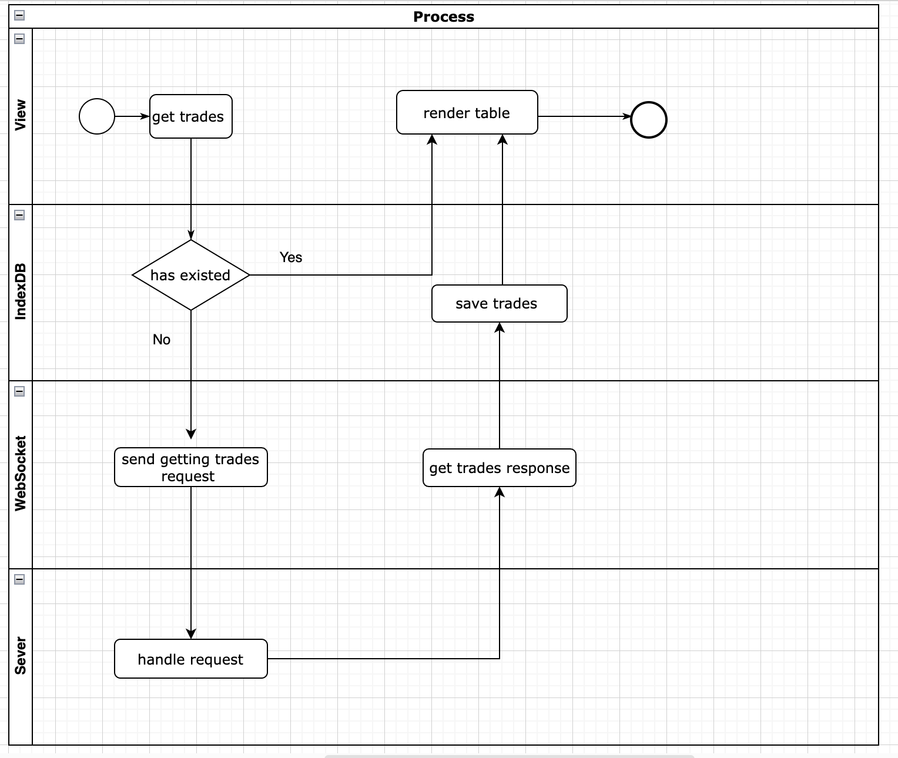
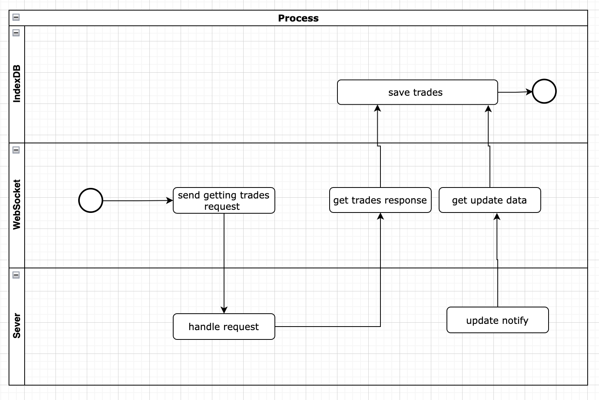

# ske-2023Q2-trade-client

This is a project which created as I join SKE event in my company EPAM. A simple example of Trading system to practise EngX culture that's promoted by EPAM.

## git started

To start this project for development, please run commands as follow.

```sh
npm install
npm start
```

If you want to deploy for production, please run `npm build` to get the artifacts built.

## System target

[Trading Platform Application.docx](./doc/%5BCoding%20Test%5D%20Trading%20Platform%20Application.docx)

Split functionality into three parts according above document.

- Initially request trade list and show in a table
- Update trades and newly add trades
- Delete and highlight trades in context menu

Tech requirement

- Performance optimiaztion
- Table should run smoothly with 10000+ records
- High quality of code standard
- Unit test and integration test
- Typescript is prefered

[Trading system requirement](https://houbb.github.io/2020/06/19/system-design-how-to-design-trade-system-01-first-sight#%E4%BA%A4%E6%98%93%E7%B3%BB%E7%BB%9F%E9%9C%80%E6%B1%82)

Key points from above requirement blog

- high availability
- high performance
- high security (ignore)

Try to do a system which can be accessed in offline condition and with high performance. Based on this target, conduct tech selection as blow.

- `react` plays as a basic render layer.
- `react-table` as a table tool which is a `headless` UI library.
- `react-window` to fix long list Rendering issues.
- `react-window-infinite-loader` to support infiniting load.
- `servicework` to fix offline available issue with cache static resouces like js, css, etc.
- `indexDB` as a cache layer to keep site high performant and access in offline condition
- `rxjs` as a powerful tool to deal with stuff in async event case.

## Design diagram

The regular process about request and response


The process of keeping sync up with sever to update cache automatically


## Reference

- [Creating a React App… From Scratch.](https://medium.com/@JedaiSaboteur/creating-a-react-app-from-scratch-f3c693b84658)

- [Full Guide: Add Eslint to React TypeScript Project](https://levelup.gitconnected.com/full-guide-add-eslint-to-react-typescript-project-406618192b9)

- [React TypeScript Cheatsheet](https://react-typescript-cheatsheet.netlify.app/docs/basic/getting-started/basic_type_example)

- [React in Ts offical](https://www.typescriptlang.org/docs/handbook/react.html)

- [a react-table component sample with virtualized](https://react-table-v7.tanstack.com/docs/examples/virtualized-rows)

- [react-window](https://github.com/bvaughn/react-window)

- [react-window-infinite-loader](https://github.com/bvaughn/react-window-infinite-loader)

- [requestIdleCallback](https://developer.mozilla.org/en-US/docs/Web/API/Window/requestIdleCallback)

- [webwork](https://developer.mozilla.org/en-US/docs/Web/API/Web_Workers_API/Using_web_workers)

- [What is a "headless" UI library?](https://react-table-v7.tanstack.com/docs/overview#what-is-a-headless-ui-library)

- [react-plugin-component](https://github.com/unnKoel/react-plugin-component)

## Q&A

- Why would we exclude node_modules when using babel-loader?

  [Why would we exclude node_modules when using babel-loader?](https://stackoverflow.com/questions/54156617/why-would-we-exclude-node-modules-when-using-babel-loader)

  [Why exclude node_modules from being transpiled by Babel?](https://stackoverflow.com/questions/66001749/why-exclude-node-modules-from-being-transpiled-by-babel)

  [Webpack not excluding node_modules](https://stackoverflow.com/questions/33001237/webpack-not-excluding-node-modules)

- keep the typescript version same between workspace and command env.

  [Using the workspace version of TypeScript](https://code.visualstudio.com/docs/typescript/typescript-compiling#_using-newer-typescript-versions)

- how to support jsx in typescript and babel

  [JSX in typescript](https://www.typescriptlang.org/docs/handbook/jsx.html)

  [Introducing the New JSX Transform](https://legacy.reactjs.org/blog/2020/09/22/introducing-the-new-jsx-transform.html)

- what's the difference between shareable configuration and plugin of ESlint

- how to fix conflicts between prettier and eslint

  [How to make ESLint work with Prettier avoiding conflicts and problems](https://dev.to/studio_m_song/how-to-make-eslint-work-with-prettier-avoiding-conflicts-and-problems-57pi)

- ?:how does babel deal with polyfill

  [@babel/plugin-transform-runtime](https://babeljs.io/docs/babel-plugin-transform-runtime#technical-details)

  [Polyfill](https://babeljs.io/docs/usage#polyfill)

  [@babel/plugin-transform-regenerator](https://babeljs.io/docs/babel-plugin-transform-regenerator)

  [@babel/preset-env#exclude](https://babeljs.io/docs/babel-preset-env.html#exclude)

  [Confused about useBuiltIns option of @babel/preset-env (using Browserslist Integration)](https://stackoverflow.com/questions/52625979/confused-about-usebuiltins-option-of-babel-preset-env-using-browserslist-integ)

  [How do I use babel's `useBuiltIns: 'usage'` option on the vendors bundle?](https://stackoverflow.com/questions/52407499/how-do-i-use-babels-usebuiltins-usage-option-on-the-vendors-bundle)

  [What is best practice for `@babel/preset-env` + `useBuiltIns` + `@babel/runtime` + `browserslistrc`](https://stackoverflow.com/questions/63231564/what-is-best-practice-for-babel-preset-env-usebuiltins-babel-runtime)

## Notices

- Don't configure path for commands in lint-staged configuration, leave path setting to lint-staged.

- Don't configure auto fixing in auto execution process.

## Result of evalution form audit

> Hi Addy，刚才的 demo 整体表现挺好的，这是我们讨论下来给你的一些改进建议
>
> To be improved:
>
> - Demo/presentation skills (time control and highlight key points).
>
> - EngX (security tools like SonarQube and Snyk, e2e tests, CI/CD, monitoring).
>
> 个人建议:
>
> - service worker 实现 offline 和 indexedDB 缓存的设计很好，后面有空闲的时候可以继续做下去
>
> - websocket 是双向连接，感觉换成 EventSource 应该性能会更好，可以尝试下
>
> - 都尝试过后，建议在我们 team 内部做一下 knowledge sharing
